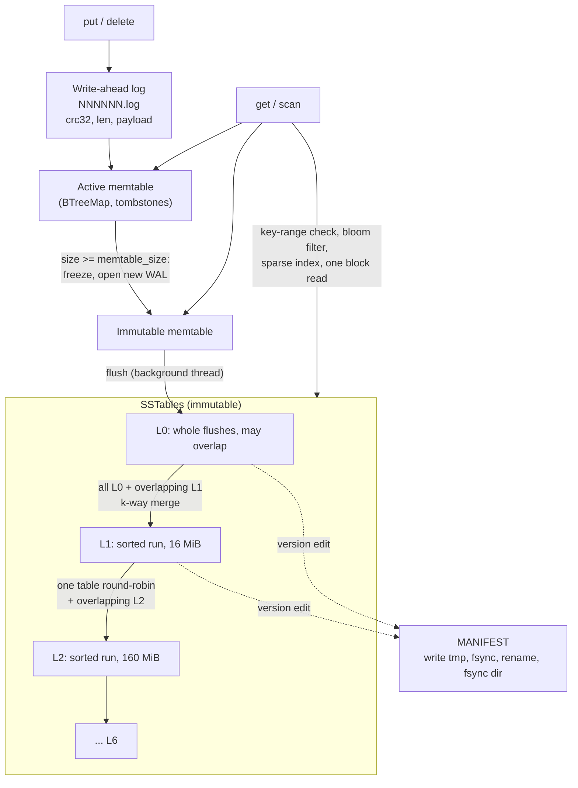

# emberdb

[](https://github.com/r5sp/emberdb/actions/workflows/ci.yml)

An LSM-tree key-value storage engine in Rust, written from scratch: checksummed
write-ahead log, memtable, bloom-filtered SSTables, leveled compaction and an atomically
updated manifest.

The only runtime dependency is `crc32fast`. The block format, bloom filter, merge
iterator, compaction picker and recovery logic are all implemented in this crate.

```rust
use emberdb::{Db, Options};

fn main() -> emberdb::Result<()> {
    let db = Db::open("/tmp/ember", Options::default())?;
    db.put("user:1", "ada")?;
    db.put("user:2", "grace")?;
    db.delete("user:1")?;

    assert_eq!(db.get("user:2")?, Some(b"grace".to_vec()));
    for kv in db.scan("user:".."user;")? {
        let (key, value) = kv?;
        println!("{} = {}", String::from_utf8_lossy(&key), String::from_utf8_lossy(&value));
    }
    db.flush()?;    // memtable -> L0 SSTable
    db.compact()?;  // merge everything into the bottom level
    Ok(())
}
```

## Contents

- [Architecture](#architecture)
- [Design decisions and tradeoffs](#design-decisions-and-tradeoffs)
- [Testing](#testing)
- [Benchmarks](#benchmarks)
- [Limitations and future work](#limitations-and-future-work)
- [Project layout](#project-layout)

## Architecture



**Write path.** A write is encoded as one WAL record (CRC32 over length and payload),
handed to the OS with a single `write_all` call, optionally fsynced, then inserted into the
memtable. When the memtable reaches `memtable_size` (4 MiB by default) it is frozen,
a new memtable and log are started, and the background thread writes the frozen one to
an L0 SSTable. If a second memtable fills before the first is flushed, the writer stalls
and helps finish the flush, which bounds memory use.

**Read path.** `get` checks the active memtable, then the immutable memtable, then L0
tables newest first, then one table per deeper level, found by binary search on key
ranges. For each candidate table the lookup goes through:

1. **Key range** (from the manifest): skip tables whose `[smallest, largest]` excludes the key.
2. **Bloom filter** (in memory): skip tables that certainly lack the key. At 10 bits per
   key the measured false-positive rate is 0.84%.
3. **Sparse index** (in memory): one entry per 4 KiB data block, keyed by the block's
   last key; binary search picks the only block that can hold the key.
4. **One block read**: a positional read of that block, a CRC check, a binary search over
   restart points, and a scan of at most 16 prefix-compressed entries.

The first value or tombstone found wins. A lookup therefore costs at most one data
block read per level, and usually none for levels that don't hold the key.

**Scans** build a k-way `MergeIterator` (binary heap keyed on `(key, source age)`) over
the memtables, each overlapping L0 table, and one concatenating iterator per deeper
level. When several sources hold the same key, only the newest is emitted; tombstones
are filtered out. A scan works on a snapshot taken when it starts: it holds `Arc`s to
the table set and is unaffected by later writes or by compactions that delete its files.

**On-disk format.** The byte layout of logs, SSTables (data blocks with restart points,
filter block, index block, 56-byte footer with magic and checksum) and the manifest is
specified in [docs/FORMAT.md](docs/FORMAT.md).

## Design decisions and tradeoffs

### Leveled compaction rather than size-tiered

An LSM tree trades among three costs: write amplification (bytes written to disk per
user byte), read amplification (places a lookup must check), and space amplification
(disk used relative to live data).

- **Size-tiered** compaction merges runs of similar size into one bigger run. Each byte
  is rewritten about once per tier, so write amplification is low. The cost is that
  many overlapping runs coexist, so a point lookup may check every run, and until a
  merge finishes the obsolete versions it will remove still take up space (up to about
  2x for the largest tier).
- **Leveled** compaction keeps every level below L0 as a single sorted run, with each
  level 10x the size of the one above it. A lookup checks at most one table per level,
  and since about 90% of the data sits in the last level, space amplification stays near
  1.1x. The price is write amplification: moving a byte from level *n* to *n+1* can
  rewrite up to ~10 bytes of the overlapping lower level.

emberdb uses leveled compaction because its goal is predictable reads. Bounded read
amplification also makes the bloom filters more effective: they mostly have to rule out
one table per level rather than a growing number of tiers. The cost shows up in the
measured write amplification below: **2.97x for sequential inserts and 5.15x for
uniformly random inserts**, counting WAL, flush and compaction bytes. A size-tiered
design would probably lower the random-insert figure but make lookups slower.

Implementation details that keep the invariants intact:

- An L0 compaction takes **all** L0 tables at that moment. Taking only some would let
  an older L0 version of a key stay above a newer one that had moved to L1.
- Deeper levels compact one table at a time, chosen **round-robin** across the key space
  so that every key range eventually gets compacted.
- A compaction with one input table and no overlap below is a **trivial move**: a
  manifest-only edit with no rewrite. The sequential benchmark made 23 such moves.
- **Shadowed versions** are always dropped during a merge. **Tombstones** are dropped only
  when no deeper level overlaps the compaction's key range, because otherwise a dropped
  tombstone would bring back an older value from below.

### Bloom filters on the read path

Without filters, every lookup of a missing key costs a block read in each table whose
key range covers it. With filters, most such tables are skipped using only memory. The
benchmark's `--bloom-bits` flag measures the effect directly (same machine and workload,
1M keys; the filters-off column comes from a separate run with `--bloom-bits 0`):

| Workload                                    | 10 bits/key   | filters off | Speedup |
|---------------------------------------------|--------------:|------------:|--------:|
| `readmissing` (absent keys inside table ranges) | 4,795,004 ops/s | 425,131 ops/s | 11.3x |
| `readrandom` on the randomly loaded DB      | 569,672 ops/s | 97,381 ops/s | 5.8x |

The randomly loaded DB benefits most because overlapping L0 tables and several levels
all cover each key, and about 37% of its lookups are for keys that were never written.
The filter costs 10 bits per key (about 1.25 MB per million keys), held in memory.

The filter is my own implementation. It computes one 64-bit hash per key and derives
`k = floor(bits_per_key * ln 2)` probe positions by Kirsch-Mitzenmacher double hashing.
Measured false-positive rates are 5.6% at 6 bits/key, 0.84% at 10 and 0.05% at 16, in
line with the theoretical `(1 - e^(-k/b))^k`.

### Durability and recovery

- `sync_writes: false` (default): each write reaches the kernel before `put` returns,
  so it survives a process crash but not a power failure. `sync_writes: true` fsyncs the
  WAL on every write.
- On recovery, WAL replay stops at the first record that is **truncated or fails its
  CRC**. A crash during an append can only damage the final record, so this keeps
  exactly the writes that were acknowledged. A record that passes its CRC but can't be
  decoded is reported as corruption, not skipped.
- The recovered memtable is flushed to L0 right away and the old logs are deleted, so
  a torn tail is never carried into the next run.
- The **MANIFEST is a full snapshot** rewritten on every change: write `MANIFEST.tmp`,
  fsync it, `rename` it over the old one, fsync the directory. A reader sees either the
  complete old version or the complete new one. LevelDB instead appends edits to a log,
  which costs O(1) per change rather than O(number of tables); a full snapshot is
  simpler to verify and cheap at this scale.
- Ordering rules: an SSTable is fsynced before any manifest refers to it, and input files
  are deleted only after the manifest that drops them is durable. Tables left
  unreferenced by a crash, logs older than the manifest's `log_number`, and stale
  `MANIFEST.tmp` files are removed on open.
- A `LOCK` file with an OS advisory lock (`File::try_lock`) keeps a second handle or
  process from opening the same directory.

### Concurrency model

- `Db` is `Send + Sync`. One `RwLock` guards the memtables, the active WAL and the
  current `Arc<Version>`. Writers hold it exclusively only for the WAL append and the
  memtable insert.
- Readers hold the lock only long enough to probe the memtable and clone `Arc`s. All
  SSTable I/O happens without the lock, using positional reads (`pread`) on shared file
  handles.
- Flushes and compactions build their output without the lock, then take it briefly to
  install a version edit ("remove these table numbers, add these"). Because the edits are
  expressed as add/remove sets, a flush and a compaction can run concurrently and their
  edits commute.
- There are no per-key sequence numbers. Each source holds one version per key, and the
  merge resolves duplicates by source age. This keeps the format simple but rules out
  multi-version snapshot reads (see future work).

## Testing

```sh
cargo test                       # 65 tests: unit, integration, property, recovery, doc
PROPTEST_CASES=500 cargo test --release --test model   # longer randomized run
cargo clippy --all-targets -- -D warnings
```

- **Unit tests** in every module cover varint and decoder bounds checks, WAL framing,
  block encoding with restart points and seeks, the bloom filter, SSTable lookups and
  iteration, corruption detection in blocks, footers and the manifest, merge-iterator
  shadowing, and compaction picking (L0 selection, round-robin, trivial moves, tombstone
  retention when deeper levels overlap).
- **Model-based property tests** (`tests/model.rs`, proptest) run random sequences of up
  to 300 `put` / `delete` / `get` / `scan` (random inclusive, exclusive and unbounded
  bounds) / `flush` / `compact` / `reopen` operations against both emberdb and a
  `BTreeMap`, with tiny memtable and level sizes so every sequence goes through many
  flushes and multi-level compactions. They run both inline and with the background
  thread. As a check that the test can catch real bugs, I injected one (always dropping
  tombstones during compaction); the property test found it and shrank it to a minimal
  failing sequence.
- **Crash-recovery tests** (`tests/recovery.rs`) write through the WAL only, then
  truncate the log at every record boundary and one byte either side of it, at 64
  random offsets, and with a byte flipped mid-log. Each recovered database must contain
  exactly the operations whose records are intact (checked against a model), must accept
  new writes, and must give the same result after a second reopen.
- **Integration tests** (`tests/api.rs`) cover snapshot isolation of scans, scans that
  keep reading while compaction deletes their files, concurrent writers and readers with
  background compaction, orphaned-file cleanup, the directory lock, and per-level
  budgets after compaction.

## Benchmarks

```sh
cargo run --release --example bench                     # defaults below
cargo run --release --example bench -- --bloom-bits 0   # filter ablation
```

Setup: 1,000,000 entries, 16-byte keys, 100-byte values, default `Options`,
single-threaded client, background compaction on, no fsync per write except in
`fillsync`. Read phases start after `wait_for_compactions()`. Measured on an Apple M5
(10 cores, 16 GB RAM, internal SSD, APFS, macOS 26.4) with Rust 1.98.1:

| Benchmark                | Throughput        | Latency      | Notes |
|--------------------------|------------------:|-------------:|-------|
| `fillseq`                | 474,204 ops/s     | 2.11 us/op   | 52.5 MB/s of user data |
| `fillrandom`             | 408,358 ops/s     | 2.45 us/op   | 45.2 MB/s of user data |
| `fillsync`               | 276 ops/s         | 3,626 us/op  | fsync per write (see below) |
| `readrandom`             | 418,816 ops/s     | 2.39 us/op   | sequential-load DB, every key present |
| `readmissing`            | 4,795,004 ops/s   | 0.21 us/op   | absent keys inside table ranges |
| `readseq` (full scan)    | 9,985,957 ops/s   | 0.10 us/op   | 1,105 MB/s |
| `readrandom` (random DB) | 569,672 ops/s     | 1.76 us/op   | ~37% misses |
| `compact` (random DB)    | 0.21 s            |              | full merge of ~69 MB |
| `readrandom` (compacted) | 631,428 ops/s     | 1.58 us/op   | single level |

Across four runs, results varied by about 5-10% (for example, `fillseq` 474k-499k ops/s
and `readrandom` 410k-439k ops/s).

| Write amplification      | User bytes | WAL    | Flush  | Compaction | Total / user |
|--------------------------|-----------:|-------:|-------:|-----------:|-------------:|
| Sequential load          | 116 MB     | 127 MB | 109 MB | 109 MB     | **2.97x**    |
| Random load (+ full compaction) | 116 MB | 127 MB | 109 MB | 362 MB | **5.15x**    |

How to read these numbers:

- The dataset (~110 MB) fits in the OS page cache, so the read benchmarks measure CPU
  and syscall cost, not SSD latency. emberdb has no block cache of its own: every lookup
  that reaches a table issues one `pread` and verifies a CRC.
- `fillsync` is limited by the device. Rust's `File::sync_data` on macOS issues
  `F_FULLFSYNC`, which flushes the drive's write cache, and that takes about 3.6 ms here.
  On Linux, `fdatasync` on the same class of hardware is usually much faster. Group
  commit would spread that cost across concurrent writers (see future work).
- The sequential load shows non-zero compaction bytes even though its key ranges never
  overlap. L0 compactions always merge all L0 tables, so four adjacent tables are
  rewritten into one sorted run instead of being moved. See future work.

## Limitations and future work

- **Block cache.** Hot blocks are re-read and re-checksummed on every access, relying on
  the OS page cache. An LRU cache of decoded blocks would mainly help `readrandom`.
- **Compression.** Blocks are stored uncompressed; per-block LZ4 or Snappy would shrink
  files and the I/O they need.
- **Sequence numbers and snapshots.** Adding a sequence number to the internal key would
  allow consistent multi-key snapshots and `WriteBatch` atomicity, and would let scans
  read the memtable lazily instead of copying the range up front.
- **Group commit.** Concurrent `sync_writes` callers each pay for their own fsync.
  Batching them behind a leader writer would multiply synced throughput.
- **Manifest as an edit log.** A full snapshot per change is O(tables); appending edits
  with periodic checkpoints would scale to very large trees.
- **Smarter L0 handling.** Moving non-overlapping L0 tables down without rewriting them,
  and splitting large compactions into parallel subcompactions.
- **Shorter index keys.** The index stores each block's full last key; a shortest
  separator between adjacent blocks would make the index smaller.
- **Platforms.** Tested on Linux and macOS. Compaction deletes input files that open
  iterators may still be reading. That is safe under POSIX unlink semantics, but on
  Windows those files would need reference-counted deletion.
- **Write stalls.** The only backpressure is waiting for a pending flush. There's no
  slowdown or stop trigger based on L0 file count.

## Project layout

```
src/
  db.rs          Db handle: write/read paths, recovery, background worker, stats
  wal.rs         write-ahead log writer and torn-tail tolerant replay
  memtable.rs    ordered in-memory buffer with tombstones
  sstable/
    block.rs     prefix-compressed blocks with restart points
    bloom.rs     bloom filter and 64-bit hash
    builder.rs   streaming SSTable writer
    table.rs     SSTable reader, point lookups and iterators
  iterator.rs    k-way merge iterator
  version.rs     immutable per-level table sets
  compaction.rs  leveled compaction picking and execution
  manifest.rs    atomic manifest snapshots
  options.rs     tuning knobs
docs/FORMAT.md   on-disk format specification
examples/        bench.rs (db_bench-style benchmark), cli.rs (put/get/scan client)
tests/           api.rs, model.rs (proptest), recovery.rs (crash simulation)
```

CLI usage:

```sh
cargo run --example cli -- /tmp/ember put hello world
cargo run --example cli -- /tmp/ember get hello
cargo run --example cli -- /tmp/ember load 100000
cargo run --example cli -- /tmp/ember scan key00000010 key00000020
cargo run --example cli -- /tmp/ember compact
```

## License

MIT. See [LICENSE](LICENSE).
